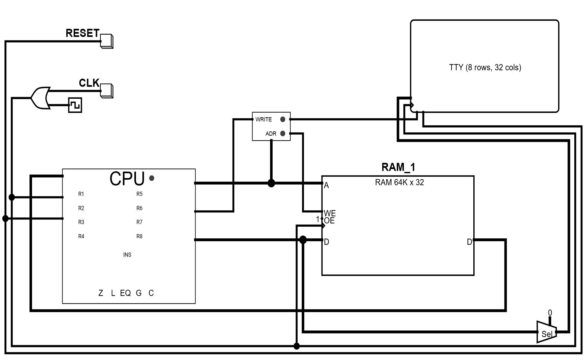
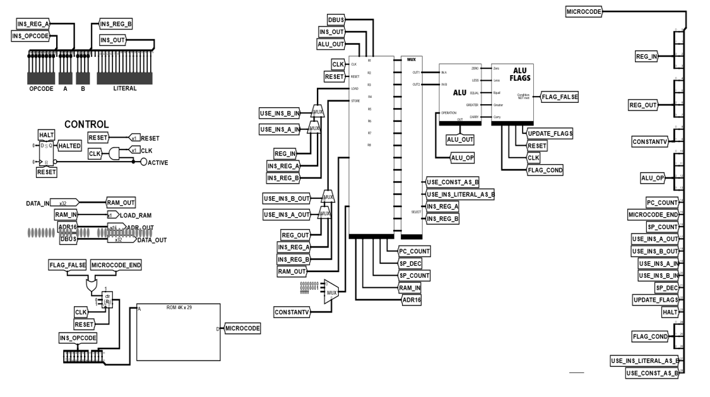
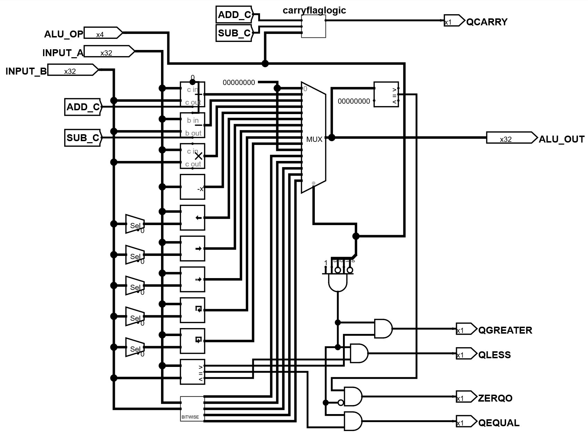
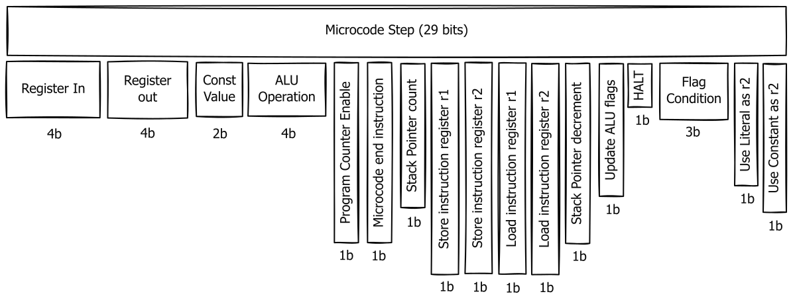
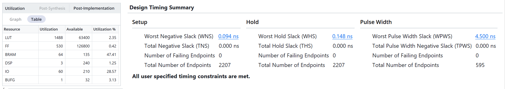
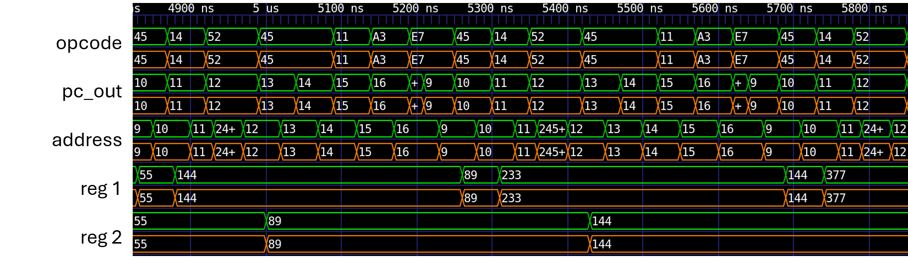
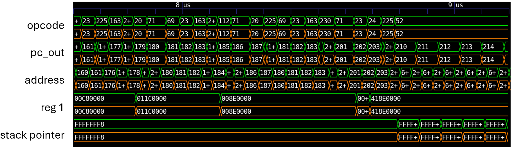

# Custom 32-bit CPU from Scratch

**Full custom 32-bit microcoded CPU** designed in Logisim, with a matching Java two-pass assembler and cycle-accurate C emulator that executes identical microcode and program files.

> **Note:** This project is split across three focused repositories for clean separation of concerns:
>
> - **Hardware (this repo)**: Logisim CPU design and diagrams
> - **Assembler**: [gw12343/custom-assembler](https://github.com/gw12343/custom-assembler)
> - **Emulator**: [gw12343/custom-emulator](https://github.com/gw12343/custom-emulator)

**Successfully running on real hardware** — the complete CPU was implemented visually in [fpga-builder](https://github.com/gw12343/fpga-builder), synthesized on a Nexys A7-100T FPGA with **zero manual Verilog edits**, achieved timing closure at **50 MHz**, and runs a playable Snake game over UART.

---

## Highlights

- Complete from-scratch 32-bit CPU (13 registers, 32-bit ALU with 5 status flags, microcoded control via 4K×29-bit ROM)
- Java two-pass assembler with strong type-checking and synchronized microcode ROM generation
- Cycle-accurate C emulator with rich GUI (Nuklear + SDL2) that matches the hardware exactly
- **Real hardware validation**: Full CPU synthesized on Nexys A7 FPGA at 50 MHz (+0.09 ns positive slack)
- Bit-exact cycle-by-cycle verification against the C emulator on multiple non-trivial workloads (Fibonacci + softfloat arithmetic)
- **Flagship demo**: Fully functional Snake game running on physical FPGA hardware (UART I/O, random apple, collision detection, scoring, custom printf with float support)

---

## Architecture

Built entirely in Logisim from basic components.

**Key Features:**
- 8 general-purpose registers (R1–R8)
- Special-purpose registers: Program Counter, Stack Pointer, Base Pointer, Address Register, Instruction Register
- 32-bit ALU supporting arithmetic, logic, and comparison operations with 5 status flags (Z, L, EQ, G, C)
- Microcoded control via a 4K × 29-bit ROM driving 29 control lines
- Memory-mapped I/O for text output at address `0x6000` and input at `0x6001`
- Executes instructions via microcode sequences (each instruction is a series of control signal steps)

**Custom 32-bit CPU Test Circuit**

The test circuit contains the CPU, RAM, reset and clock controls, and a TTY text display. A memory-mapping unit connects address **0x6000** to the display, allowing software to write output by storing data at that location. The reset and clock buttons support manual reset and single-step execution for testing.

**Overall CPU Diagram ** 

The main CPU circuit begins with an instruction decoder (top left) that splits the current instruction into its fields  and displays them on an LED bar. Below it are the halt logic, microcode counter, and microcode ROM. To the right, the  register bank feeds into the register multiplexer, which connects to the ALU and then to the ALU flags register bank. On  the far right, the 29 microcode control lines are labeled by function, with some grouped to form multi-bit selection

**Register Bank**

The register bank contains eight general-purpose registers (**R1–R8**) and several special-purpose registers: the stack pointer (with up/down counting), base pointer, instruction register, program counter (with increment capability), and a 16-bit address register. To the right, a multiplexer selects the register indexed by the 4-bit DSTORE signal to place its value on the data bus. For loading, a demultiplexer uses the 4-bit DLOAD signal to assert the write-enable line of the targeted register, allowing it to load data from the bus. 

**The Flag Register**

The flag register stores the **Z**, **L**, **EQ**, **G**, and **C** flags, updating them when the microcode’s update_flags signal is active. Each flag has an LED indicator. On the right, a conditional logic unit receives a 4-bit condition code (e.g., 0000 = none, 0001 = JNZ, 0010 = JZ, 0011 = JL) and uses a multiplexer to determine if the specified condition is false, outputting flag_false. In the main CPU circuit, this signal resets the microcode counter to terminate the instruction early, preventing the jump from occurring.

**ALU**

The ALU accepts two 32-bit inputs, **A** and **B**, along with a 4-bit operation select signal that chooses from 15 available operations. It produces a 32-bit result and outputs the **Z**, **L**, **EQ**, **G**, and **C** flags for zero, less-than, equal, greater-than, and carry conditions.

 

 The Arithmetic Logic Unit supports comprehensive operations:

- Arithmetic: ADD, SUB with carry, MUL
- Logic: AND, OR, XOR, NOT, NAND, LSL, ASR
- Comparison: Less than, equal, greater than
- Status flags for conditional operations

#### Microcode Control

Instructions execute through microcode sequences that define step-by-step control signals:

- 29 control lines manage data flow
- Conditional execution based on flag states
- Extensible instruction set through ROM update

The format of all instructions is:

| **--------opcode--------** | **----r1----** | **----r2----** | **------------------------------literal------------------------------** |
| -------------------------- | -------------- | -------------- | ------------------------------------------------------------ |
| 8 bits                     | 4 bits         | 4 bits         | 16 bits                                                      |

​       The first 8 bits are always populated and taken to be the current opcode. Following it, are two 4 bit segments, which are used by some instructions to index certain registers. Lastly, there are 16 bits available as a literal number for calculations, a memory address for absolute or indirect addressing operations, or whatever else is needed. 

---

## Toolchain – Assembler & Microcode ROM Generator

**Java-based** two-pass assembler that also generates the microcode ROM.

**Key Features:**
- Strong operand type-checking (REGISTER, IMMEDIATE, MEMORY, etc.)
- Label resolution
- Easily extensible instruction definitions via enums
- Guarantees consistency between assembler and hardware (both use the same microcode definitions)

See the dedicated [custom-assembler](https://github.com/gw12343/custom-assembler) repository for source code and details.

---

## Emulator & Debug Environment

**Cycle-accurate C emulator** with a rich GUI (Nuklear + SDL2) that simulates the CPU at the microcode level.

**Features:**
- Live register, flag, and memory inspection
- Step-through or continuous execution at adjustable speed
- Instruction viewer and hex memory viewer with live highlights
- Terminal output capture via memory-mapped I/O
- Much faster and more interactive than running programs directly in Logisim

See the dedicated [custom-emulator](https://github.com/gw12343/custom-emulator) repository.

---

## FPGA Implementation & Real Hardware Verification

The entire CPU was implemented visually using **[fpga-builder](https://github.com/gw12343/fpga-builder)** (drag-and-drop node editor → synthesizable Verilog).

**Results:**

- Synthesized in Vivado on a **Nexys A7 FPGA** with **zero manual Verilog edits**

- Timing closure achieved at **50 MHz** (critical path: 16 logic levels, +0.09 ns positive slack)

- Full cycle-by-cycle equivalence with both the original Logisim model and the C emulator

  

### Verification Waveforms

The generated RTL for the CPU was verified with reference to the cycle-accurate emulator by direct comparison of the waveforms (op_code, pc_out, add, reg 1/2, and stack pointer) for non-trivial test programs.

**Fibonacci sequence test**:

**IEEE 754 softfloat arithmetic test**:

All waveforms showed full correspondence between reference emulator and RTL implementation.

---

## Integration & Workflow

1. Write assembly program
2. Run through the assembler → produces `Program.rom` and `Microcode.rom`
3. Load into Logisim, the C emulator, or the FPGA flow
4. Debug and iterate

This pipeline guarantees that hardware, toolchain, and emulator are always perfectly in sync.

---

## Getting Started

### Logisim Simulation
Open the `.circ` files in Logisim Evolution.

### Build & Run the Emulator
See the [custom-emulator](https://github.com/gw12343/custom-emulator) repository.

### Assemble Programs
See the [custom-assembler](https://github.com/gw12343/custom-assembler) repository.

### FPGA Flow
Use [fpga-builder](https://github.com/gw12343/fpga-builder) to visually implement the CPU and generate Verilog for Vivado.

---

## License

To be determined.

---

